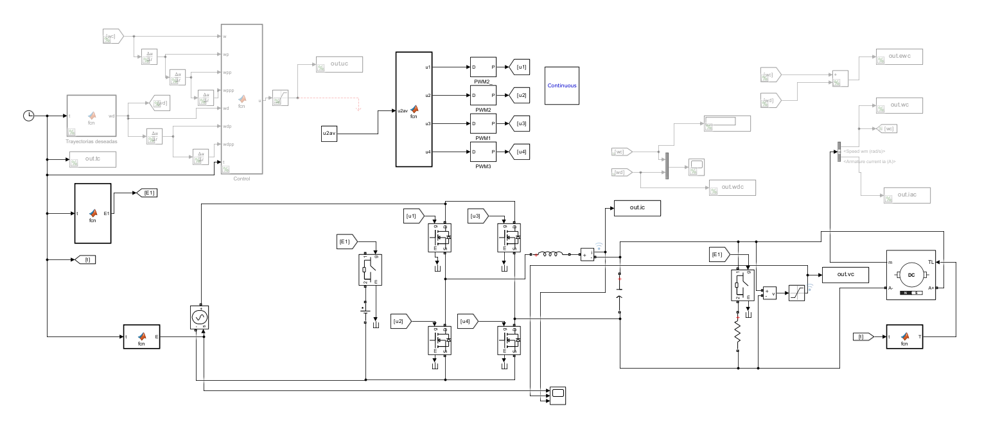
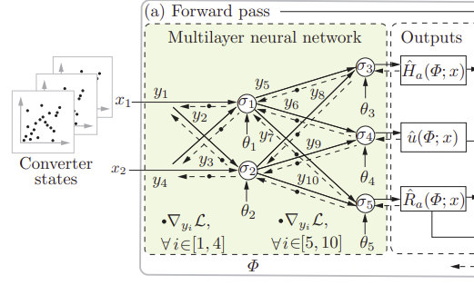

# Red Neuronal para el Control de un Convertidor de DC - DC
## Proyecto-Terminal

## Integrantes
- **Jorge Luis Santiago Canto**
- **Alan Torres Aguilar**

## Descripción
Eeste proyecto terminal presenta el diseño y entrenamiento de una red neuronal, espesificamente una Physics-Informed Neural Network (PIIN) para estabilizar y controlar un convertidor de potencia DC-DC.

Esta red neuronal no aprende ciegamente de los datos, sino que está fundamentada en el modelo de **Sistemas Hamiltonianos-Puertos**. El objetivo del repositorio es procesar la dinámica de energía del circuito (utilizando el flujo magnético y la carga eléctrica) y utilizar la red neuronal para resolver las ecuaciones de acoplamiento y control basado en pasividad (IDA-PBC).

El código abarca desde el preprocesamiento de simulaciones y limpieza de datos, hasta la definición de las matrices físicas del circuito y la arquitectura base del controlador neuronal, buscando garantizar la estabilidad de Lyapunov para el hardware de potencia.

## Estructura del Repositorio
El proyecto está dividido en dos etapas principales
- Preprocesamiento de datos dinámicos 
- Diseño del controlador neuronal.

## Archivos:

- **`Circuito_SM_I.slx`**: Modelo original del convertidor DC-DC construido en Simulink, utilizado para generar las trayectorias de energía de la planta.

  

- **`simulaciones.h5`**: Base de datos maestra en formato HDF5 que almacena el histórico de las variables de estado (corriente y voltaje) para miles de iteraciones de simulación.
- **`Fix4simErr.m`**: Script de control de calidad en MATLAB. Escanea el dataset masivo en busca de simulaciones corruptas o incompletas y utiliza procesamiento paralelo (`parsim`) para re-simular y parchar exclusivamente los datos con errores.
- **`CleanPandas.py`**: Script de Análisis Exploratorio de Datos (EDA) en Python. Utiliza la librería Pandas para extraer y analizar los instantes iniciales y finales de cada simulación, garantizando que el circuito alcanzó un punto de equilibrio estable ($x^*$) apto para el entrenamiento.
- **`NeuralNetwork.py`**: Archivo núcleo de la Inteligencia Artificial (PyTorch). Contiene las matrices estáticas del modelo Port-Hamiltonian y la arquitectura base (cascarón) de la red neuronal profunda (PINN) que actuará como controlador.

  

## Requisitos y Dependencias
- **MATLAB R202x** (con Simulink y Parallel Computing Toolbox)
- **Python 3.8+**
- **PyTorch**
- `pandas`
- `h5py`

## To-Do
-  **Transformación de Coordenadas** 
-  **Función de Costo y Diferenciación**